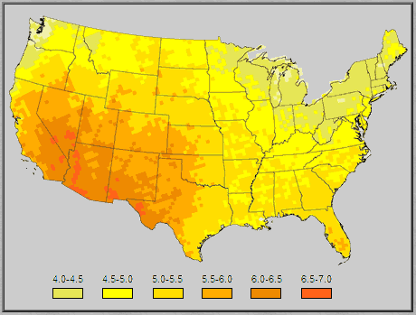
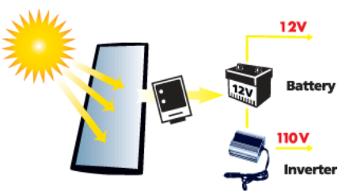
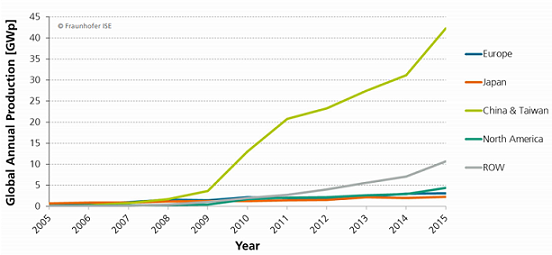
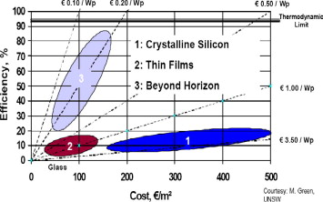
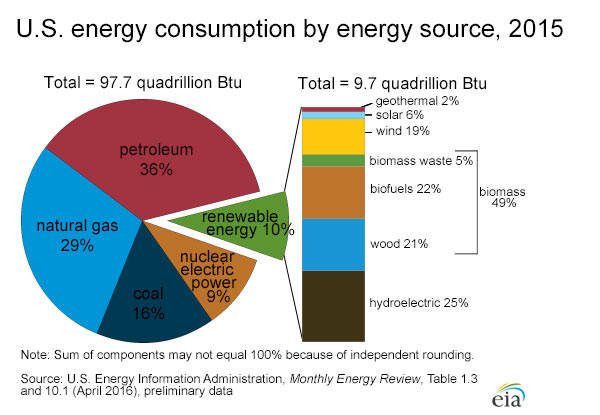
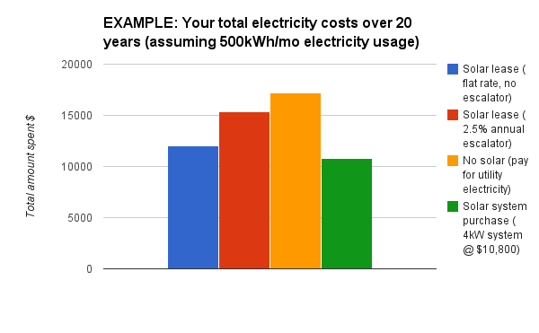
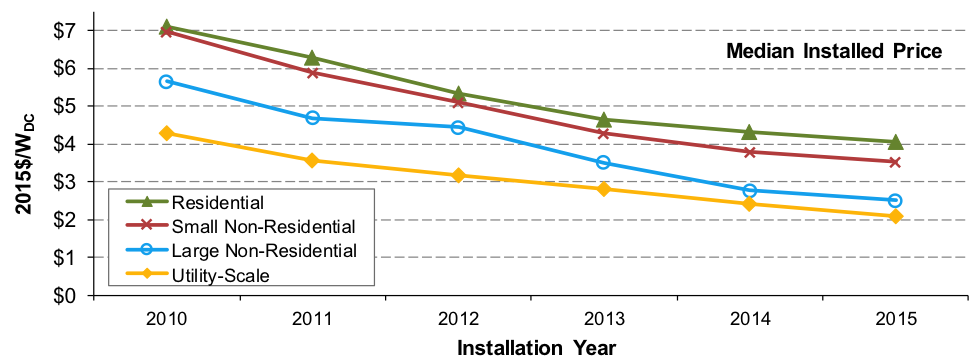

```{r setup, include=FALSE}
knitr::opts_chunk$set(warning=FALSE, message=FALSE, echo=FALSE)
knitr::opts_chunk$set(tidy.opts=list(width.cutoff=80),tidy=TRUE)
options(scipen=999)
```

```{r, results='hide'}

if (!require("devtools",character.only = TRUE)) (install.packages("devtools",dep=TRUE))
if (!require("yaml",character.only = TRUE)) (install.packages("yaml",dep=TRUE))
if (!require("rprojroot",character.only = TRUE)) (install.packages("rprojroot",dep=TRUE))
if (!require("knitcitations",character.only = TRUE)) (install.packages("knitcitations",dep=TRUE))
if (!require("RefManageR",character.only = TRUE)) (install.packages("RefManageR",dep=TRUE))
if (!require("scales",character.only = TRUE)) (install.packages("scales",dep=TRUE))
```

```{r , load libraries}
library(knitcitations)
library(RefManageR)
library(devtools)
library(yaml)
library(papaja)
library(rprojroot)
library(triangle)
library(ggplot2)
library(gridExtra)
library(dplyr)
library(reshape)
library(scales)
```


```{r bib-data, echo=FALSE}
Mantosh <- bibentry(bibtype="Misc",
                 publisher="photoemission",
                 author=personList(person(family="Chawla", given="Mantosh")),
                 title="Selecting right solar simulator",
                 year=2011,
                 url="http://www.photoemission.com/techpapers/A%20step%20by%20step%20guide%20to%20selecting%20a%20Solar%20Simulator%20Ver.%203.pdf")


energysage <- bibentry(bibtype="Misc",
                 author=personList(person(family="Sage", given="Energy")),
                 title="Residential electricity prices going up or down",
                 year=2016,
          url="http://news.energysage.com/residential-electricity-prices-going-up-or-down/")

basics <- bibentry(bibtype="Misc",
                 author=personList(person(family="sunforce", given="")),
                 title="Basics of Solar Power for Producing Electricity",
                 year=2015,
                 url="http://www.sunforceproducts.com/Support%20Section/Solar%20Panel%20&%20Charge%20Controllers/The%20Basics%20of%20Solar%20Power%20for%20Producing%20Electricity.pdf")


eia <- bibentry(bibtype="Misc",
                 author=personList(person(family="EIA", given="")),
                 title= "EIA FAQ",
                 year= 2015,
                 url= "https://www.eia.gov/tools/faqs/faq.cfm?id=97&t=3")


IOPScience <- bibentry(bibtype="Article",
                 author=personList(person(family="E M", given="Natsheh"), 
                                   person(family="A", given="Albarbar")),
                 title="Solar power plant performance evaluation",
                 year=2012,
                 journal = "IOP Science",
                 url="http://iopscience.iop.org/article/
                 10.1088/1742-6596/364/1/012122/pdf")

ScienceDirect <- bibentry(bibtype="Article",
                 author=personList(person(family="T.M. Razykov", given=""), 
                                   person(family="C.S. Ferekides", given=""),
                                   person(family="E. Stefanakos", given=""),
                                   person(family="H.S. Ullal", given=""),
                                   person(family="H.M.Upadhyaya", given="")),
                 title="Solar photovoltaic electricity:Current status and future",
                 year=2011,
                  journal = "Sicene Direct",
                 url="http://www.sciencedirect.com/science/article/pii/S0038092X1000366X")

simulation.sd <- bibentry(bibtype="Article",
                 author=personList(person(family="Bellia", given="Habbati"), 
                                   person(family="Youcef", given="Ramdani"),
                                   person(family="Fatima", given="Moulay")),
                 title="A detailed modeling of photovoltaic module using MATLAB",
                 year=2014,
                  journal = "Sicene Direct",
                 url="http://www.sciencedirect.com/science/article/pii/S2090997714000182")


free.sun.power <- bibentry(bibtype="Misc",
                 author=personList(person(family="Sun Power", given="Free")),
                 title="Solar Energy systems wiring diagram",
                 year=2016,
                 url="http://www.freesunpower.com/example_systems.php#examples")


house.hold <- bibentry(bibtype="Misc",
                 author=personList(person(family="statista", given="")),
                 title="average-size-of-households-in-the-us",
                 year=2016,
                 url="https://www.statista.com/statistics/183648/average-size-of-households-in-the-us/")

ny.solar <- bibentry(bibtype="Misc",
                 author=personList(person(family="nrel", given="gov")),
                 title="Solar Radiation - NYC",
                 year=2016,
                 url="http://rredc.nrel.gov/solar/old_data/nsrdb/1961-1990/redbook/sum2/94728.txt")


sa <- bibentry(bibtype="Misc",
                 author=personList(person(family="scientific", given="american")),
                 title="scientificamerican",
                 year=2016,
                 url="https://blogs.scientificamerican.com/plugged-in/the-price-of-solar-is-declining-to-unprecedented-lows/")


markov <- bibentry(bibtype="Misc",
                 author=personList(person(family="Munkhammar", given="Joakim")),
                 title="Markov chain modeling of energy users and electric vehicles",
                 year=2012,
                 url="http://uu.diva-portal.org/smash/get/diva2:608393/fulltext01.pdf%7C")


```


# Abstract

Solar energy has the greatest potential of all the sources of renewable energy. If only a small amount of this
form of energy could be used, it will be one of the most important supplies of energy. In this work, we will attempt to simulate a model comprising of the photovoltaic array, battery storage, controller and converters, and produce energy generation, consumption stats. We would then compare that with the traditional grid electricity  to determine if going with *solar* makes economic sense or not.

# Keywords

Solar; Photovoltacis; Power Inverter; electricity; kWh


# Introduction

The world energy consumption is 10 terawatts per year, and by 2050, its projected to be about 30 TW. The world will need about 20 TW of non-$CO_{2}$ energy to stabilize the $CO_2$ in the atmosphere by mid-century.The simplest scenario to stabilize $CO_2$ by mid-century is to use the renewables for electricity generation `r citep(ScienceDirect)`.

Solar power works well for majority of the items except large electric appliances that use an electric *heat element* such as a water heater, clothes dryer and electric stove - for example - or total electric home heating systems. Its not cost effective to use solar power for these items. So, for these utilities , natural gas, propane or other alternative is usually recommended. 

Using solar power to produce electricity is not the same as using solar to produce heat. Solar *thermal* principles are applied to produce hot fluids or air. *Photovoltaic* principles are used to produce electricity. A solar panel (PV Panel) is made of the natural element, *silicon*, which becomes charged electrically when subjected to sun light. This electrical charge is consolidated in the PV Panel and directed to the output terminals to produce low voltage (Direct Current). The intensity of the Sun's radiation changes with the hour of the day, time of the year and weather conditions. So, to be able to make calculations in planning a system, the total amount of solar radiation energy is expressed in hour of full sunlight per day - *peak sun hours* (average amount of sun available per day thoughout the year). So depending on the intended geographical location, we might need more or less solar panels - for example, we need more solar panels in northeastern U.S. to produce the same overall power as those living in Arizona. `r citep(basics)`



\newpage

## Components used to provide solar power:

  The 4 primary components for producing electricity using solar power, which commonly provides 110-120 volt AC power for daily use are: Solar panels, charge controller, battery and inverter. Solar panels charge the battery, and the charge regulator ensures proper charging of the battery. The battery provides DC voltages to the inverter, and the inverter converts the DC voltage to normal AC voltage.



\newpage


# Literature Review  

## PV Panels

We have reviewed few articles, news items, journal papers related to the solar power generation and consumption. The journal paper `r citep(ScienceDirect)` talks about the *Solar photovoltaic electricity: Current and future prospects* , which mainly focuses on the PV market and several leading types of solar cells, such as c-Si, pc-Si and amorphous-Si and nano-PV.  

This paper talks about the *third generation PV* thats based on nanostructures. Nanostructured solar cells offer several advantages for solar cells, including: (1) the ability to exceed a single junction solar cell efficiency by implementing new concepts, (2) the ability to overcome practical limitations in existing devices, such as tailoring the material properties of existing materials or using nanostructures to overcome constraints related to lattice matching, and (3) the potential for low-cost solar cell structures using self-assembled nanostructures.  <center></center>

## Energy Sources in U.S.

We also reviewed *eia* (_U.S.Energy Information Administration_) articles and statistics related to various engergy consumptions by source. `r citep(eia)`. Majority of the energy in U.S. is sourced from *pertroleum* today, followed by *natural gas*, *coal*, *nuclear*, and then *renewable energy* (10%). Among the renewable energy *solar* quota is only 6% today. So with the costs of the solar energy coming down and the grid electricity costs are increasing `r citep(energysage)` , this may be the better time to explore the renewable energey opportunities.

<center></center>

## Is residential electricity price going up or down ?

 The article `r citep(energysage)` mentions that the retail residential electricity rates ( the amount you pay per kilowatt-hour) have risen across the nation at a rate of about *4%* on average over the last 10 years. Natural gas prices are likely to increase , and as they do electricity rates will rise; However, some areas of country have witnessed sharper price increases than others: for example, electricity rates in Hawaii have more than doubled over the past 10 years, while they've hardly changed in Texas. However, having a solar energy system can help you insulate against these fluctuations.


\newpage

## Simulators

Reviewed the journal paper *A detailed modeling of photovoltaic module using MATLAB*, which focuses on simulating a PV module. The PV module is the interface which converts light into electricity. The input variables here is the weather data (irradiance and temparature), and the output is the *current / power / voltage*. The paper presented a detailed modeling of the effect of irradiance and temparature on the parameters of the PV module. The simulation was conducted using MATLAB/SimuLink software.

Also reviewed another case study *Solar power plant performance evaluation: simulation and experimental validation* `r citep(IOPScience)`, which evaluated the performance of solar power plant located in central Manchester. Measurements were taken over 21 month's period; using hourly average irradiance and cell temparature. The developed performance evaulation technique could be adoped to detech reasons that may degrade the performance of the PV panels such as heavy snow, shading and dirt. The paper concludes that good agreement was achieved between the theoretical simulation and the real time measurement taken the online grid connected solar power plant.


# Methodology 

This project will be split into 2 main parts.

- Energy Generation
- Energy Consumption

## Data Preparation 

This phase primarily focuses on collecting various data elements for both energy generation and consumption:

Some of the data preparation steps may include:

- Find Dataset to help us estimate/model usable daylight for a specific location
- Find information regaurding how much power is generated with a PV system. i.e. a 4kW sytem needs 5 panels or 30 square feet of panels. etc.
- What is average family size (adults and children)
- Family composition. Is the house empty during work hours? 
- What is the roof size and how much panels can it hold
- Typical household electricity usage.
- Typical electrical appliance usage in the house

## Simulation & Model Development 

Our primary objective here is to determine *if solar energy system makes economic sense or not*. So, we will attempt to simulate the energy generation with various solar panel systems, and household utilities, and eventually compare the overall cost with the grid based electricity.

For simulation we will be using the *R / R-Studio* and *Simio* environments.

## Validation 

Compare the solar Vs grid based electricity costs, also research the future state of the costs for both solar and traditional electricity sources. 

# Experimentation and Results 

## Data Preparation 

 Lets prepare the monthly average hours of sunlight of New York City `r citep(ny.solar)` , and the average consumption `r citep(house.hold)`:

```{r}
#Monthly Avg Hours sunlight - NYC
#http://rredc.nrel.gov/solar/old_data/nsrdb/1961-1990/redbook/sum2/94728.txt
monthlyavg <- c(3.2, 4.0, 4.8, 5.2, 5.4, 5.5, 5.6, 5.5, 5.0, 4.4, 3.2, 2.8)
monthlymin <- c(2.5, 3.2, 3.9, 4.4, 4.5, 4.5, 4.8, 4.9, 4.3, 3.7, 2.4, 1.9)
monthlymax <- c(4.0, 5.2, 5.7, 6.0, 6.1, 6.2, 6.1, 6.1, 5.8, 5.6, 4.1, 3.4)
monthdays <- c(31,28,31,30,31,30,31,31,30,31,30,31)
month <- c(1:12)

#https://rocscience.com/help/roctopple/webhelp/roctopple/Triangular_Distribution.htm
monthlyMode <- 3*monthlyavg-monthlymin-monthlymax

sun.df <- data.frame(monthdays, monthlymin, monthlymax, monthlyavg, month)

sun.df$month <- factor(sun.df$month)
g1 <-  ggplot(data = sun.df , aes(x=month, y=monthlyavg)) + geom_bar(stat="identity") +  theme(axis.text=element_text(size=8), axis.title=element_text(size=10)) + ggtitle("Monthly Avg sunlight")

g2 <-  ggplot(data = sun.df , aes(x=month, y=monthlymin)) + geom_bar(stat="identity") +  theme(axis.text=element_text(size=8), axis.title=element_text(size=10)) + ggtitle("Monthly Min sunlight")

g3 <-  ggplot(data = sun.df , aes(x=month, y=monthlymax)) + geom_bar(stat="identity") +  theme(axis.text=element_text(size=8), axis.title=element_text(size=10)) + ggtitle("Monthly Max sunlight")

g4 <-  ggplot(data = sun.df , aes(x=month, y=monthlyMode)) + geom_bar(stat="identity") +  theme(axis.text=element_text(size=8), axis.title=element_text(size=10)) + ggtitle("Monthly Mod sunlight")

grid.arrange(g1,  g2, g3, g4, nrow=2, top = "Sunlight in NYC")
```

Now, fetch the average power consumption for home appliances and electronics in NYC `r citep(eia)`, the below shows the daily averaged values in kWh.

```{r}
#Appliance Consumption
#http://energy.gov/energysaver/estimating-appliance-and-home-electronic-energy-use

#Average NY Electricity Use
#http://www.eia.gov/electricity/sales_revenue_price/xls/table5_a.xlsx

#Average Family size: 2.54
#https://www.statista.com/statistics/183648/average-size-of-households-in-the-us/
#Census.gov :2.63

#Observed Data
monthlyusage <- c(491,409,78,616,198,1321,1849,1265,512,312,310,491)
averageuse <- monthlyusage/monthdays

sun.df$monthlyusage <- monthlyusage
sun.df$daily.avgusage <- averageuse

ggplot(data = sun.df , aes(x=month, y=daily.avgusage)) + geom_bar(stat="identity") +  theme(axis.text=element_text(size=8), axis.title=element_text(size=10)) + ggtitle("Daily Avg usage/month")
```

Note: Per EIA, the electricity usage in U.S. follows the normal distribution with sd of 1520 kWh. In overall U.S. the average household power usage is 901 kWh/month and 10812 kWh/year.

## Simulation

Typically, a modern solar panel produces between 250 to 270 watts of peak power (0.25 to 0.27 kWh).Because of physics, there are losses in converting the energy from the sun into DC power, and turning the DC power into AC power. This ratio of AC to DC is called the 'derate factor', and is typically about .8. This means we convert about 80% of the DC power into AC power.

To figure out how many kilowatt-hours (kWh) OUR solar panel system puts out per year, WE need to multiply the size of OUR system in kW DC times the .8 derate factor times the number of hours of sun. So if we have a 7.5 kW DC system working an average of 5 hours per day, 365 days a year, it'll result in 10,950 kWh in a year.

### Simulation in R

Here's the high level view of the simulation flow in R:

<center></center>

```{r}

replication <-1000
#panel.size <- 5
panel.seq <- seq(from=5, to=40, by=5)

#Simulation Starts here
pwr.con <- data.frame()
summary.gen <- data.frame()
summary.con <-data.frame()

for (panel in panel.seq)
{
  panel.size <- panel
  pwr.gen <- data.frame()

  for(run in 1:replication) 
  {
    #https://understandsolar.com/calculating-kilowatt-hours-solar-panels-produce/
    panel.kwh <- rtriangle(365,.2,.27,.25)
    
    dayssunlight <- vector()
    for (i in 1:length(monthdays))
    {
      dayssunlight <- c(dayssunlight,(rtriangle(monthdays[i],monthlymin[i],monthlymax[i],monthlyMode[i])))
    }
    
    #80% Derate Factor
    power.gen <-(dayssunlight*panel.size*panel.kwh)*.8
  
    rnd.daily <- vector()
    for (i in 1:length(monthdays))
    {
      rnd.daily <- c(rnd.daily,(rnorm(monthdays[i],averageuse[i])))
    }
    
    run.gen <- t(as.data.frame(power.gen))
    run.gen <- cbind(panel.size,run.gen)
    pwr.gen <- rbind(pwr.gen, run.gen)

    run.consume <- t(as.data.frame(rnd.daily))
    pwr.con <- rbind(pwr.con, run.consume)
    
  }
  colnames(pwr.gen) <- c('Num Panels', 1:365)
  rownames(pwr.gen) <- c(1:nrow(pwr.gen))
  
  #colnames(pwr.con) <- c(1:365)
  #rownames(pwr.con) <- c(1:nrow(pwr.con))
  
  temp.gen <- t(as.data.frame(apply(pwr.gen,2,mean)))
  #temp.con <- t(as.data.frame(apply(pwr.con,2,mean)))
  
  summary.gen <- rbind(summary.gen, temp.gen)
  #summary.con <- rbind(summary.con, temp.con)
}

summary.con <- t(as.data.frame(apply(pwr.con,2,mean)))

total.gen <- as.data.frame(apply(summary.gen[,-1], 1, sum))
#summary.gen <-

colnames(summary.gen) <- c('Num Panels', 1:365)
rownames(summary.gen) <- c(1:nrow(summary.gen))

colnames(summary.con) <- c(1:365)
rownames(summary.con) <- c(1:nrow(summary.con))


#### Simulation Results:
summary.gen.long <- reshape(summary.gen, direction="long", varying=list(names(summary.gen)[2:366]), v.names="Value", idvar=c("NumPanels"))

#View(summary.gen.long)
summary.gen.long1 <- summary.gen.long %>%
                     mutate(month = ifelse(time %in% c(1:31), "Jan" , 
                                    ifelse(time %in% c(32:59), "Feb",
                                    ifelse(time %in% c(60:90), "Mar",
                                    ifelse(time %in% c(91:120), "Apr",
                                    ifelse(time %in% c(121:151), "May",
                                    ifelse(time %in% c(152:181), "Jun",
                                    ifelse(time %in% c(182:212), "Jul",
                                    ifelse(time %in% c(213:243), "Aug",
                                    ifelse(time %in% c(244:273), "Sep",
                                    ifelse(time %in% c(274:304), "Oct",
                                    ifelse(time %in% c(305:334), "Nov",
                                    ifelse(time %in% c(335:365), "Dec",NA)))))))))))))

#View(summary.gen.long1)
summary.gen.long1$month <- factor(summary.gen.long1$month, levels= c("Jan", "Feb", "Mar","Apr","May","Jun","Jul","Aug","Sep","Oct","Nov","Dec"))


panel_5 <- summary.gen.long1 %>% filter(summary.gen.long1$"Num Panels" == '5')
panel_10 <- summary.gen.long1 %>% filter(summary.gen.long1$"Num Panels" == '10')
panel_15 <- summary.gen.long1 %>% filter(summary.gen.long1$"Num Panels" == '15')
panel_20 <- summary.gen.long1 %>% filter(summary.gen.long1$"Num Panels" == '20')
panel_25 <- summary.gen.long1 %>% filter(summary.gen.long1$"Num Panels" == '25')
panel_30 <- summary.gen.long1 %>% filter(summary.gen.long1$"Num Panels" == '30')
panel_35 <- summary.gen.long1 %>% filter(summary.gen.long1$"Num Panels" == '35')

g1 <- ggplot(panel_5, aes(time, Value)) + geom_line() +  labs(x = "Day", y = "kWh", title="5 Panels") 
g2 <- ggplot(panel_10, aes(time, Value)) + geom_line() + labs(x = "Day", y = "kWh", title="10 Panels")
g3 <- ggplot(panel_15, aes(time, Value)) + geom_line() + labs(x = "Day", y = "kWh", title="15 Panels")
g4 <- ggplot(panel_20, aes(time, Value)) + geom_line() + labs(x = "Day", y = "kWh", title="20 Panels")
g5 <- ggplot(panel_25, aes(time, Value)) + geom_line() + labs(x = "Day", y = "kWh", title="25 Panels")
g6 <- ggplot(panel_30, aes(time, Value)) + geom_line() + labs(x = "Day", y = "kWh", title="30 Panels")

grid.arrange(g1,  g2, g3, g4,g5,g6, nrow=3, top = "Power Generation from Panels")

ggplot(panel_25, aes(x=month, y=Value)) + geom_bar(stat="identity") +xlab("Month") + ylab("kWh") + ggtitle("kWh generated with 25 panels - Monthly View")


#Energy Consumption Summary Plots###########

temp.con <- as.data.frame(summary.con)

rownames(temp.con) <- c('power.con.kw')
temp.con1 <- reshape(temp.con, direction="long", varying=list(names(temp.con)[1:365]), v.names="Value")

ggplot(temp.con1, aes(time, Value)) + geom_line() + xlab("Days in a Year") + ylab("KWt") + ggtitle("Average Power Consumption for an year")

#ggplot(data = test , aes(x=test$'Num Panels', y=test$Value)) +  geom_line() + geom_point()

#sum(temp.con1$Value)
#sum(panel_25$Value)
```

The total power consumption from simulation is around 7900 kWh. So, we need 25 panels, to generate the 8000 kWh of power.


### Simulation in Simio with specific appliances

Since we were not able to simulate the solar circuit with Simio, we tried to simulate the flow of watts with few pre-defined assumptions ( like average 6 hours of peak sun - each 2kW panel generates 320 watts, and the assumptions for utilites - 60 watts per hour for house lights for 3 hours per day, 210 watts per hour for television for about 2 to 3 hours a day, 140 watts for refrigerator, 500 watts usage of microwave for 30 minutes, 75 watts per hour for computer etc.) 

And tried to simulate the 4 kW Panels with generally used household appliances. 

<center></center>

<center></center>


## Validation

Here is the summarized results from our simulation above with varying panel sizes, and 1000 replications for each panel:

```{r}
avg.kwh.year <- 9500

panels.energy <- c(0, sum(panel_5$Value),sum(panel_10$Value),sum(panel_15$Value),sum(panel_20$Value),sum(panel_25$Value),sum(panel_30$Value),sum(panel_35$Value))

panel.count <- seq(from=0, to=35, by=5)

trad.elec.kwh.needed <- c(ifelse(round(avg.kwh.year - panels.energy) <= 0, 0, round(avg.kwh.year - panels.energy, 2)))

yearly.saving <- (avg.kwh.year - trad.elec.kwh.needed) * 0.18

validation.table <- data.frame(panel.count, 
                               format(round(panels.energy,2), big.mark = ","),  
                               format(trad.elec.kwh.needed, big.mark = ","),
                               dollar_format()(yearly.saving))

colnames(validation.table) <- c("Panels", "Avg Solar Energy (kWh)", "Avg Grid Elec Need (kWh)", "Avg Yearly Solar Savings")

knitr::kable(validation.table, align = "r")
```

_Assumptions_: We did not consider the initial solar system implementation costs here for simplicity. Also, the average electricity need is assumed as around 9500 kWh (which is NYC's average. Also average cost per kWh is assumed as 18 cents). The simulation considered the average day light data in NYC.

With these assumptions, it appears that, *with 30 solar panels we would be mostly self sufficient for an average annual electricity consumption needs*.

\newpage

__Here's a recent research that compares the costs of solar vs electricity including the initial solar costs:__

As of early 2016, most U.S homeowners are paying $3 to $4 per watt to install a solar panel system, and the average cost per watt in the U.S. is $3.57 per watt.So, a 8kW solar energy system could cost approximately $20,000. The solar electricity that our system produces will be 'free' once the system has paid itself off (which will take approximately 5-10 years, depending on where you live).

<center></center>


# Conclusion 

As the price of solar is declining to unprecedented lows `r citep(sa)` and the increasing electricity prices (*from 9 cents per kWh in 2005 to about 13 cents per kWh in 2014*), the renewable energy sources like solar seems to be more efficient and cost-effective. 

## Future work:

- Develop *R Shiny application*, with an ability to capture the input values for zipcode, appliances, etc. and provide recommendation for number of panels needed, battery size etc. and estimate the cost of installation, considering the factors like geographical solar radiation levels, local government solar subsidies (if any) etc.

- Performing the simulation of actual solar system circuit with battery and inverter capturing the seasonal estimates of the solar power generation.

- Review & Explore the possibility of the usage of Markov-chain model for producing the electricity consumption data from activities. `r citep(markov)`


\newpage

# References

```{r bib-references, results='asis', echo=FALSE, message=FALSE}
BibOptions(style="html", bib.style="authortitle")
bibliography()
```

\newpage

## Appendix 

### Solar Installation Prices Over the years

<center></center>


### R code

```{r eval=FALSE, echo=TRUE, options(width = 80)}
library(triangle)

#Monthly Avg Hours sunlight - NYC
#http://rredc.nrel.gov/solar/old_data/nsrdb/1961-1990/redbook/sum2/94728.txt
monthlyavg <- c(3.2, 4.0, 4.8, 5.2, 5.4, 5.5, 5.6, 5.5, 5.0, 4.4, 3.2, 2.8)
monthlymin <- c(2.5, 3.2, 3.9, 4.4, 4.5, 4.5, 4.8, 4.9, 4.3, 3.7, 2.4, 1.9)
monthlymax <- c(4.0, 5.2, 5.7, 6.0, 6.1, 6.2, 6.1, 6.1, 5.8, 5.6, 4.1, 3.4)
monthdays <- c(31,28,31,30,31,30,31,31,30,31,30,31)

#https://rocscience.com/help/roctopple/webhelp/roctopple/Triangular_Distribution.htm
monthlyMode <- 3*monthlyavg-monthlymin-monthlymax

#Appliance Consumption
#http://energy.gov/energysaver/estimating-appliance-and-home-electronic-energy-use

#Average NY Electricity Use
#http://www.eia.gov/electricity/sales_revenue_price/xls/table5_a.xlsx

#Average Family size: 2.54
#https://www.statista.com/statistics/183648/average-size-of-households-in-the-us/
#Census.gov :2.63

#Observed Data
monthlyusage <- c(491,409,78,616,198,1321,1849,1265,512,312,310,491)
averageuse <- monthlyusage/monthdays

replication <-100
#panel.size <- 5
panel.seq <- seq(from=5, to=40, by=5)

#Simulation Starts here
replication <-100
#panel.size <- 5
panel.seq <- seq(from=5, to=40, by=5)

#Simulation Starts here
pwr.con <- data.frame()
summary.gen <- data.frame()
summary.con <-data.frame()

for (panel in panel.seq)
{
  panel.size <- panel
  pwr.gen <- data.frame()

  for(run in 1:replication) 
  {
    #https://understandsolar.com/calculating-kilowatt-hours-solar-panels-produce/
    panel.kwh <- rtriangle(365,.2,.27,.25)
    
    dayssunlight <- vector()
    for (i in 1:length(monthdays))
    {
      dayssunlight <- c(dayssunlight,(rtriangle(monthdays[i],monthlymin[i],monthlymax[i],monthlyMode[i])))
    }
    
    #80% Derate Factor
    power.gen <-(dayssunlight*panel.size*panel.kwh)*.8
  
    rnd.daily <- vector()
    for (i in 1:length(monthdays))
    {
      rnd.daily <- c(rnd.daily,(rnorm(monthdays[i],averageuse[i])))
    }
    
    run.gen <- t(as.data.frame(power.gen))
    run.gen <- cbind(panel.size,run.gen)
    pwr.gen <- rbind(pwr.gen, run.gen)

    run.consume <- t(as.data.frame(rnd.daily))
    pwr.con <- rbind(pwr.con, run.consume)
    
  }
  colnames(pwr.gen) <- c('Num Panels', 1:365)
  rownames(pwr.gen) <- c(1:nrow(pwr.gen))
  
  #colnames(pwr.con) <- c(1:365)
  #rownames(pwr.con) <- c(1:nrow(pwr.con))
  
  temp.gen <- t(as.data.frame(apply(pwr.gen,2,mean)))
  #temp.con <- t(as.data.frame(apply(pwr.con,2,mean)))
  
  summary.gen <- rbind(summary.gen, temp.gen)
  #summary.con <- rbind(summary.con, temp.con)
}

summary.con <- t(as.data.frame(apply(pwr.con,2,mean)))

total.gen <- as.data.frame(apply(summary.gen[,-1], 1, sum))
#summary.gen <-

colnames(summary.gen) <- c('Num Panels', 1:365)
rownames(summary.gen) <- c(1:nrow(summary.gen))

colnames(summary.con) <- c(1:365)
rownames(summary.con) <- c(1:nrow(summary.con))


#### Simulation Results:
summary.gen.long <- reshape(summary.gen, direction="long", varying=list(names(summary.gen)[2:366]), v.names="Value", idvar=c("NumPanels"))

#View(summary.gen.long)
summary.gen.long1 <- summary.gen.long %>%
                     mutate(month = ifelse(time %in% c(1:31), "Jan" , 
                                    ifelse(time %in% c(32:59), "Feb",
                                    ifelse(time %in% c(60:90), "Mar",
                                    ifelse(time %in% c(91:120), "Apr",
                                    ifelse(time %in% c(121:151), "May",
                                    ifelse(time %in% c(152:181), "Jun",
                                    ifelse(time %in% c(182:212), "Jul",
                                    ifelse(time %in% c(213:243), "Aug",
                                    ifelse(time %in% c(244:273), "Sep",
                                    ifelse(time %in% c(274:304), "Oct",
                                    ifelse(time %in% c(305:334), "Nov",
                                    ifelse(time %in% c(335:365), "Dec",NA)))))))))))))

#View(summary.gen.long1)
summary.gen.long1$month <- factor(summary.gen.long1$month, levels= c("Jan", "Feb", "Mar","Apr","May","Jun","Jul","Aug","Sep","Oct","Nov","Dec"))


panel_5 <- summary.gen.long1 %>% filter(summary.gen.long1$"Num Panels" == '5')
panel_10 <- summary.gen.long1 %>% filter(summary.gen.long1$"Num Panels" == '10')
panel_15 <- summary.gen.long1 %>% filter(summary.gen.long1$"Num Panels" == '15')
panel_20 <- summary.gen.long1 %>% filter(summary.gen.long1$"Num Panels" == '20')
panel_25 <- summary.gen.long1 %>% filter(summary.gen.long1$"Num Panels" == '25')
panel_30 <- summary.gen.long1 %>% filter(summary.gen.long1$"Num Panels" == '30')
panel_35 <- summary.gen.long1 %>% filter(summary.gen.long1$"Num Panels" == '35')

g1 <- ggplot(panel_5, aes(time, Value)) + geom_line() +  labs(x = "Day", y = "kWh", title="5 Panels") 
g2 <- ggplot(panel_10, aes(time, Value)) + geom_line() + labs(x = "Day", y = "kWh", title="10 Panels")
g3 <- ggplot(panel_15, aes(time, Value)) + geom_line() + labs(x = "Day", y = "kWh", title="15 Panels")
g4 <- ggplot(panel_20, aes(time, Value)) + geom_line() + labs(x = "Day", y = "kWh", title="20 Panels")
g5 <- ggplot(panel_25, aes(time, Value)) + geom_line() + labs(x = "Day", y = "kWh", title="25 Panels")
g6 <- ggplot(panel_30, aes(time, Value)) + geom_line() + labs(x = "Day", y = "kWh", title="30 Panels") 

grid.arrange(g1,  g2, g3, g4,g5,g6, nrow=3, top = "Power Generation from Panels")

ggplot(panel_25, aes(x=month, y=Value)) + geom_bar(stat="identity") + ggtitle("Kwt generated with 25 panels - Monthly View")

#Energy Consumption Summary Plots###########

temp.con <- as.data.frame(summary.con)

rownames(temp.con) <- c('power.con.kw')
temp.con1 <- reshape(temp.con, direction="long", varying=list(names(temp.con)[1:365]), v.names="Value")

ggplot(temp.con1, aes(time, Value)) + geom_line() + xlab("Days in a Year") + ylab("KWt") + ggtitle("Average Power Consumption for an year")


avg.kwh.year <- 9500

panels.energy <- c(0, sum(panel_5$Value),sum(panel_10$Value),sum(panel_15$Value),sum(panel_20$Value),sum(panel_25$Value),sum(panel_30$Value),sum(panel_35$Value))

panel.count <- seq(from=0, to=35, by=5)

trad.elec.kwh.needed <- c(ifelse(round(avg.kwh.year - panels.energy) <= 0, 0, round(avg.kwh.year - panels.energy, 2)))

yearly.saving <- (avg.kwh.year - trad.elec.kwh.needed) * 0.17

validation.table <- data.frame(panel.count, 
                               format(round(panels.energy,2), big.mark = ","),  
                               format(trad.elec.kwh.needed, big.mark = ","),
                               dollar_format()(yearly.saving))

colnames(validation.table) <- c("Panels", "Avg Solar Energy (kWh)", "Avg Grid Elec Need (kWh)", "Avg Yearly Solar Savings")

knitr::kable(validation.table, align = "r")

#ggplot(data = test , aes(x=test$'Num Panels', y=test$Value)) +  geom_line() + geom_point()

#sum(temp.con1$Value)
#sum(panel_25$Value)

#The average cost per watt in the U.S. is $.22 per kWh.
#https://www.bls.gov/regions/new-york-new-jersey/news-release/averageenergyprices_newyorkarea.htm

#Average energy bill
avg.watt <- c(0.186,0.182,0.187,0.188,0.177,0.190,0.191,0.191,0.191,0.179,0.178,0.182)

#http://www.engineering.com/ElectronicsDesign/ElectronicsDesignArticles/ArticleID/7475/What-Is-the-Lifespan-of-a-Solar-Panel.aspx

#Simulate daily cost of electricity based on montly average of 2016
kWh.daily <- vector()
save.gen <- vector()

for (panel in 1:length(panel.seq))
{
  kWh.daily <- vector()
  for (i in 1:length(monthdays))
  {
    kWh.daily <- c(kWh.daily,(rnorm(monthdays[i],avg.watt[i], sd=sd(avg.watt))))
  }
    temp.gen <- cbind(panel.seq[panel],(summary.gen[panel,2:ncol(summary.gen)]*kWh.daily))
    save.gen <- rbind(save.gen, temp.gen)
}
#MAYBE: simulate life expectancy of system

money <- as.data.frame(apply(save.gen[,-1], 1, sum))
rownames(money) <- panel.seq
colnames(money) <- c("Savings")

bill.year <- summary.con*watt.daily
total.year <-sum(bill.year)

View(money)

##-----------------------------------------------------


 
#totalbill for 15 years
(sum(totalbill)*solarlifeexpectancy)

diff_inenergy <- abs(sum(rnd.daily)-sum(run.gen))
toutility <- diff_inenergy *avg.bill

#Estimated Cost of solar panel
  #6kW solar energy system cost: $15,000
  #8kW solar energy system cost: $20,000
  #10kW solar energy system cost: $25,000
  #15kW solar energy system cost: $34,000


df.solarcost <- data.frame(c(6,8,10,15),c(8,10,15),c(15000,20000,25000,34000))
colnames(df.solarcost) <- c("Start_kwatts","End_kwatts", "cost")

for (i in 1: length(df.solarcost))
{
  if (df.solarcost[i,1]<=sum(run.gen)/1000 && df.solarcost[i,2] >=sum(run.gen)/1000 ) 
  {
    initialcost <- df.solarcost[i+1,3]
  }
}

print(initialcost)
Total_panelcost = initialcost + toutility*solarlifeexpectancy

data.frame(Total_panelcost,Total_utilityBill)

```
