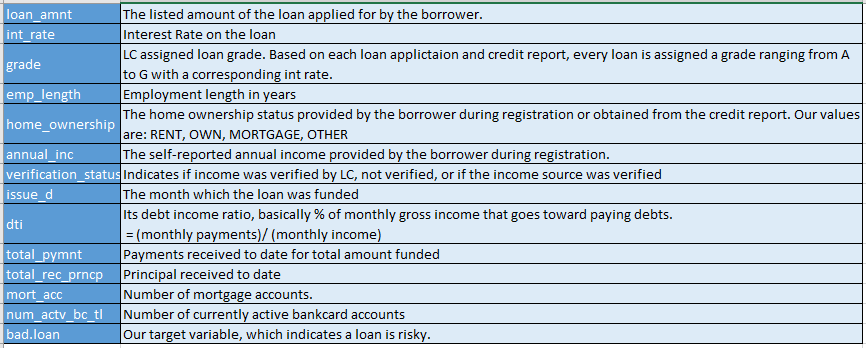
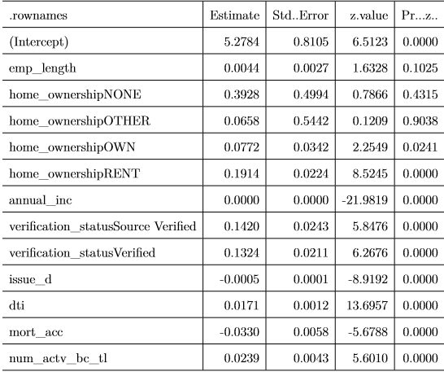
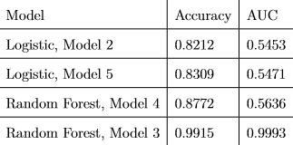

Credict Risk Analysis  LendingClub Loan Data
========================================================
author: Sreejaya, Vuthy and Suman
date: 12/11/2016
font-family: 'Garamond'
transition: zoom

DATA621 Business Analytics & Data Mining  CUNY SPS
------------------------

Agenda
========================================================

-	Research Question
- Data Source
-	Data Exploration
- Data Preparation
-	Model Building
- Model Validation
-	Results
- Future work

Research Question
========================================================

 __How safe is to invest in these loans ?__

LendingClub is an online lending platform for loans. Borrowers apply for a loan online, and if accepted, the loan gets listed in the market place. As an investor you can browse the loans and chosse to invest in individual loans at your discretion. In this project, we attempted to analyse the loandata and predict the *risk* of loans.

Data Source
========================================================

- Loan Data, 2012-13 (https://resources.lendingclub.com/LoanStats3b.csv.zip)

- Observations: <b>188,183</b>

- Variables: <b>111</b>

Data Exploration - Loans by status
========================================================

Data Exploration - Grade Vs Int Rates
========================================================

Data Exploration - Loan Amount by Grade
========================================================

Data Exploration - Loan Status Vs Grade
========================================================

Data Preparation - Feature Selection
========================================================

- First, select a high level list of features based on domain understanding:
   (for example - *loan amount*, *interest rate*, *debt to income ratio*, *grade*, *emp_length* etc.)
   
- Review *matured loans*. (issue date + term months < today)

- How to label a loan as bad or good ?
    - If the loan is *default/charged off/late* then we will treat it as a *risky loan*

- Further we plan on eliminating some numeric type features that do  not have significant differences in the bad/good populations by looking at their distributions.

Data Prepation - Variable distributions
=========================================================

Data Prepation - Correlations
=========================================================

Data Preparation - Tidying Data
=========================================================

 - Remove features with majority of NAs ( 80% NAs)
 - Convert the date fields like issue date to proper date type
 - Remove % sign for interest rates, dti and convert those into numeric values.
 - Consider matured loans only. [ issue date + term months < today ]
 - Factorize the loan status levels with proper ordering. 
 - Loans issued by LendingClub fall into three categories of verification: "income verified," "income source verified," and "not verified." 
 -The "home ownership" is another factor variable provided by the borrower during registration Or obtained from the credit report. The values are: RENT, OWN, MORTGAGE, OTHER.
  

Data Prepation - Final Features
=========================================================

Model Building - Logistic with all variables
=========================================================
 

***
  
Noticed high VIF variables here:

  - loan_amt
  - int_rate
  - grade
  - total_pymnt
  - total_rec_prncp

Model Building - Logistic by removing high VIF vars
=========================================================

Model Building - Random Forest with all variables
=========================================================

***
  
With 500 trees, the random forest shows the this Gini index - a measure how each variable contribute to the homogenity of the nodes and leaves in the resulting random forest.

Model Building - Random Forest by removing high VIF vars
=========================================================

***
  
Here it shows the dti, annual income are high importance variables, also its interesting to see the issue date is also shown as an important variable here.

Model Building - Logistic including important vars from Random Forest
=====================================================================
We tried to include the important variables from random forest, and build logistic model again.

Except emp_length all other predictors are significant here.

Model Validation - Logistic
==========================================================

AUC for both the logistic models is around 0.55 

 

***

Model Validation - Random Forest
==========================================================

AUC for both RF with selected variables is 0.91 , but when considered all vars, it is 0.99

 

***

Results
==========================================================

***
*Random Forest, Model 3*, where all variables included, performed well here. It has got the AUC [ P(predicted TRUE|actual TRUE) Vs P(FALSE|FALSE) ], and the accuracy [ P(TRUE|TRUE).P(actual TRUE) + P(FALSE|FALSE).P(actual FALSE) ], are both higher compared to the other models.

Future work
==========================================================

Future work - we will try including more predictors, and possibly loading data before the year 2012. And plan on including the *Naive Bayes* classification analysis, Possibly *Multinomial Logistics Regression* to the model suite.
